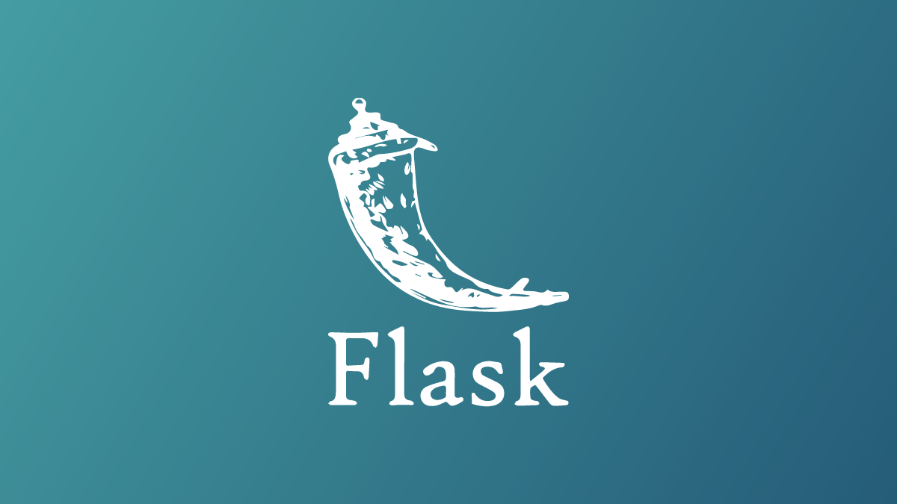

# Flask App - Python Web Project  

A simple web application built using the **Flask** framework in Python, featuring basic user authentication with a database.

---
<p align="center">
  
</p>


## 🚀 Features
- User login & sign-up system  
- Flask-based routing and templating  
- SQLite database integration  
- Modular project structure (`instance/`, `website/`, `review/`)  
- Easy to extend and maintain  

---

## 📂 Project Structure
```bash
├── instance/
│   └── database.db        # SQLite database
├── review/                # Optional project notes or reports
├── website/
│   ├── __pycache__/       # Compiled Python cache
│   ├── static/            # Static files (CSS, JS, images)
│   │   ├── base.css
│   │   └── index.js
│   ├── templates/         # HTML templates
│   │   ├── base.html
│   │   ├── home.html
│   │   ├── login.html
│   │   └── sign_up.html
│   ├── __init__.py        # Flask app factory
│   ├── auth.py            # Authentication routes
│   ├── views.py           # Main page views
│   └── models.py          # User model / database operations
│
└── main.py                # App entry point

 

## ⚙️ How to Use and Install
```

to install:
```sh
pip install flask
```


To run:
```sh
py main.py
```

open http://localhost:5000
